# NCCL CP

NCCL CP provides two primitives for context-parallel: `group_cast` and `group_reduce` with reduction type of both sum & lse through `nccl.cp`, aiming for both training and inference cp communication with high performance and low SM usage. **This project is still under early development**

## CP Communication and Computation Patterns
With sequence partitioning across N CP ranks, each rank holds a shard of Q, KV, or both. Local queries on each cp rank may attend to
KV tokens owned by other ranks. There are two ways to bring those tensors
together: move the required KV shards to the Q owner, or move Q to the required
KV owners.

The diagrams below describe these communication patterns. Their API labels are
schematic: NCCL CP currently supports tensor casts and sum reductions;
`cast_lse=True` and `reduce_op="lse"` are not implemented. See
[Tensor and Reduction Contract](#tensor-and-reduction-contract) for supported
arguments.

### KV Communication

**Forward.** Q stays on its owning rank. Each rank receives the remote KV shards
needed by its local Q and computes attention over local and received KV to
produce the local attention output O. KV distribution maps to `group_cast`.
If attention is computed in stages over separate KV shards, the partial outputs
are merged locally using their log-sum-exp (LSE) values; no output reduction
across ranks is needed.

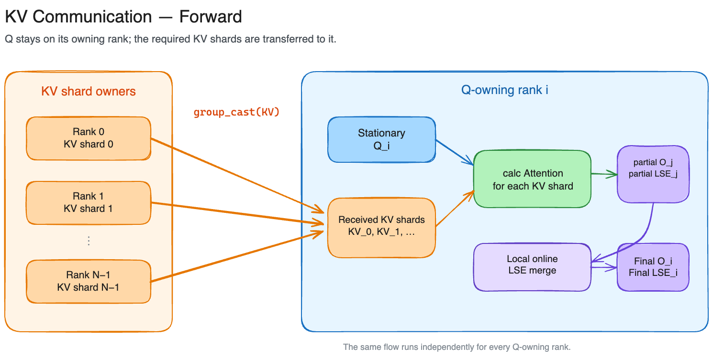

**Backward.** Receive the required KV shards again and compute attention backward
using local Q, the complete forward output O, the upstream gradient dO and the
final forward LSE. Contributions to dQ are accumulated locally. Each computed
dK/dV contribution must return to the owner of its KV shard, where contributions
from all Q-owning ranks are summed with `group_reduce` to obtain the complete
local KV gradient.

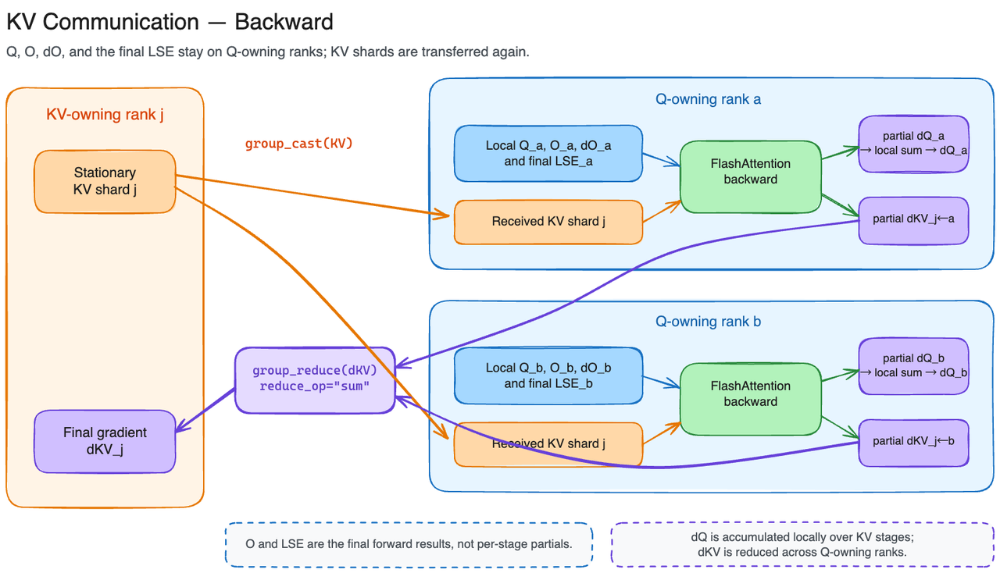

### Q Communication

**Forward.** KV shards stay on their owning ranks. Send each local Q to the ranks
that own the KV it needs to attend to. Each recipient computes attention using
its local KV shard, producing a partial output O_r and a partial LSE_r. Return
these results to the Q owner and combine the outputs using LSE-derived weights:

$$
O = \sum_{r=0}^{N-1} [\mathrm{softmax}(\ell)]_r O_r,
\qquad \ell = [\mathrm{LSE}_0, \mathrm{LSE}_1, \ldots, \mathrm{LSE}_{N-1}].
$$

The weights are computed across participating KV shards for each query and
attention head. Q distribution can be omitted when Q is already replicated on
the participating ranks. The LSE-weighted output merge requires additional
logic beyond NCCL CP's current sum reduction.

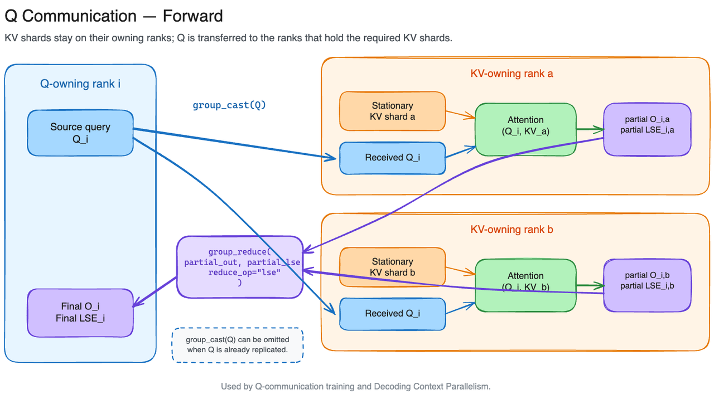

**Backward.** Send Q, the complete forward output O, dO and the final merged LSE
to the KV-owning ranks that participated in the forward pass. Each rank computes
the contribution of its local KV shard to dQ. Return these partial dQ tensors
to the Q owner and sum them to obtain the complete dQ. Each KV owner accumulates
dK/dV from all relevant queries locally, so no cross-rank dK/dV reduction is
required. This backward flow applies to training; decoding CP runs only the
forward flow.

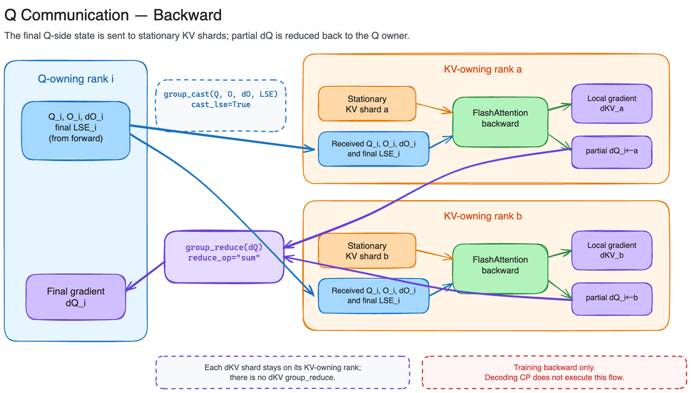

### Summary

| Property | KV communication | Q communication |
|---|---|---|
| Stationary data | Q | KV shards / KV cache |
| Transferred attention input | KV shards | Q |
| Attention compute location | Q-owning rank | KV-owning rank |
| Typical use cases | Training, especially GQA/MQA | Training and decoding CP |
| Forward distribution | Cast KV to Q owners | Cast Q to KV owners; omit if Q is already replicated |
| Forward output merge | Local LSE merge when processing KV in stages | Return partial O and LSE to Q owners for an LSE-weighted merge |
| Backward distribution | Cast KV to Q owners again | Send Q, complete O, dO and final LSE to KV owners |
| Backward gradient reduction | Sum dK/dV at KV owners; accumulate dQ locally | Sum dQ at Q owners; accumulate dK/dV locally |

Decoding CP uses the Q-communication forward pattern with a stationary KV cache
and has no backward pass. In both training patterns, the distributed flow is
built from selective distribution to consumers and reduction back to owners.
NCCL CP provides the tensor `group_cast` and sum `group_reduce` primitives for
these routes; attention computation and LSE-based merging remain the caller's
responsibility.

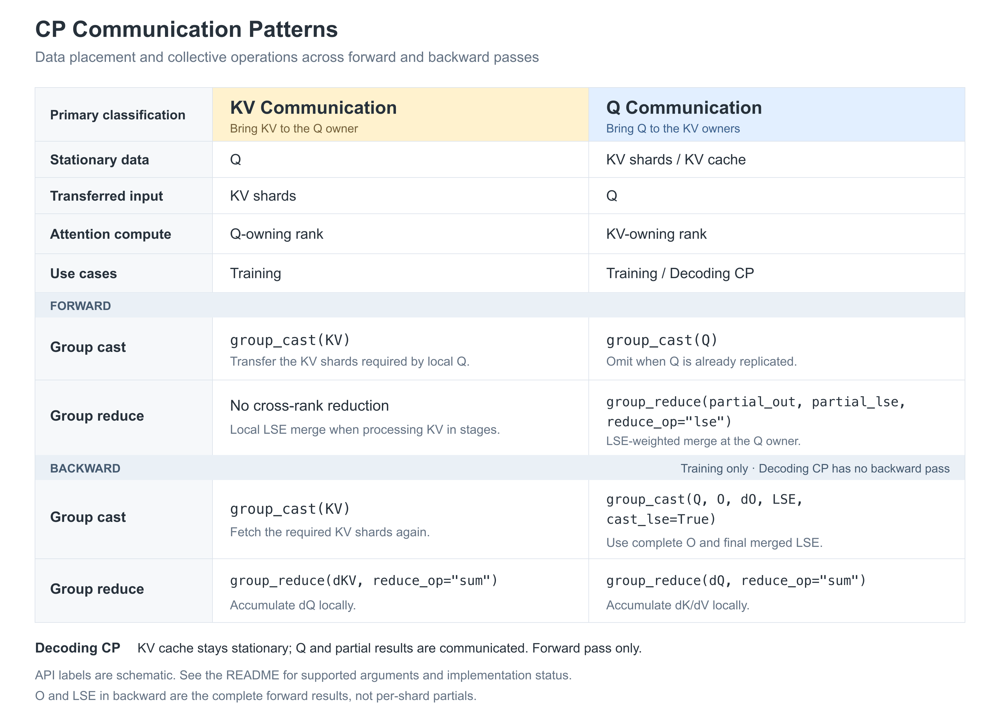

## Basic API Design

### a2av pattern for zero redundancy communication

The `group_cast` and `group_reduce` primitives were originally introduced in
[MagiAttention](https://github.com/SandAI-org/MagiAttention). `group_cast` and `group_reduce` use an all-to-all-v (a2av) communication pattern to
eliminate redundant token transfers. `group_cast` delivers only the Q or KV
tokens each rank needs, while `group_reduce` returns and aggregates the
corresponding contributions at their owners.

Not every rank needs to exchange tokens with peers. A rank whose local Q, K,
and V are sufficient for its computation does not need to receive remote tokens.
If it also has no data or contributions to send to peers and no relay duties,
it exchanges no token payloads. The ranks involved in a given cast or reduction
can therefore be a subset of the full CP communication group, hence the name
"group"

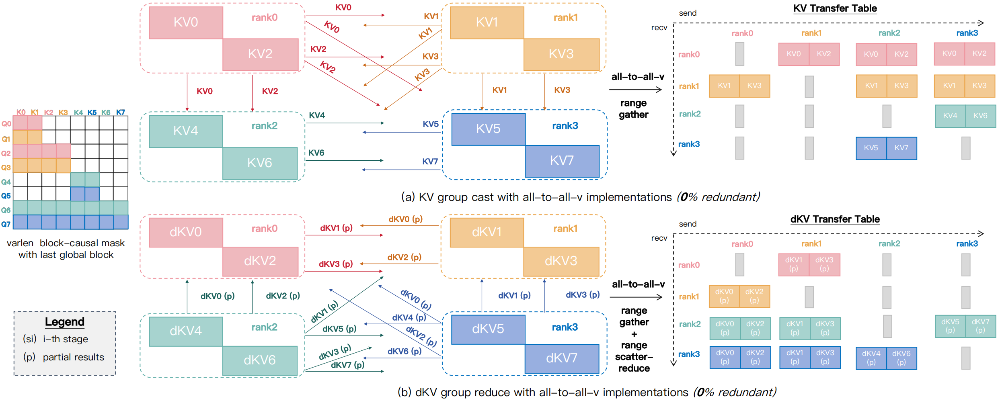

*Source: [MagiAttention — Group Collective Primitives](https://sandai-org.github.io/MagiAttention/docs/main/blog/magi_attn.html#group-collective-primitives).*

### Token layouts and communication plans

Each rank uses a `list[TokenRange]` to describe the tokens it owns before
communication (`local_input_layout`), and another to describe the tokens it
needs (`local_output_layout`). The requested layout can include tokens to fetch
from other ranks and any locally owned tokens needed in the result. These
tokens can represent Q or KV, depending on the higher-level CP implementation.

`create_handle` combines the ownership and request layouts across ranks to
generate a reusable CP communication execution plan, recorded in a handle.
Passing that handle to `group_cast` or `group_reduce` executes the corresponding
prepared communication plan. The handle abstracts execution details, allowing
internal optimizations such as hierarchical communication and traffic load
balancing across network interfaces (NICs).

For a causal-attention KV-communication example, rank 0 owns tokens `[0, 4096)`
and rank 1 owns tokens `[4096, 8192)`. Across its local Q tokens, rank 1 needs
KV tokens `[0, 8192)`: it keeps its local KV and fetches `[0, 4096)` from rank 0.
The attention kernel applies the causal mask (`k <= q`) for each query.
Pseudocode on rank 1:

```python
handle = create_handle(
    group,
    local_input_layout=[TokenRange(4096, 8192)],
    local_output_layout=[TokenRange(0, 8192)],
    stream=stream,
)
group_cast(handle, kv_local, kv_full, stream=stream)
attn_output = flash_attn_func(q_local, kv_full, causal=True)
```

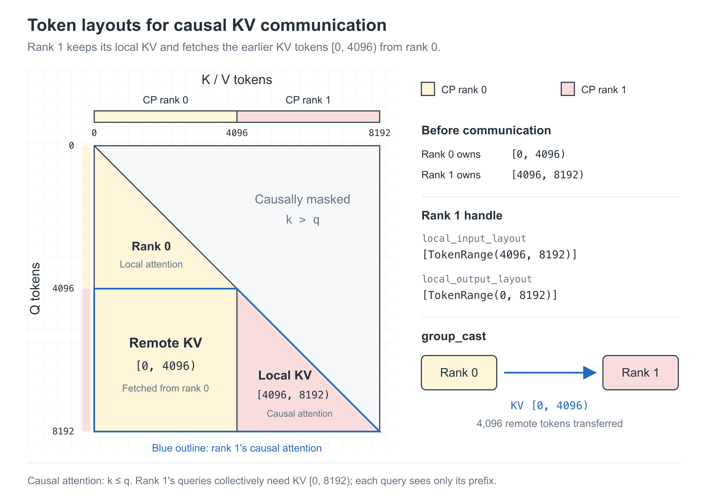

See the [two-rank forward/backward example](#two-rank-causal-attention-forward-and-backward)
for the complete communication flow.

#### Packed variable-length samples

In practice, a variable-length sample may pack multiple documents. Each document
has its own causal mask, with no attention across document boundaries. A CP rank
may own several disjoint Q/KV chunks from different documents, requiring
`group_cast` to gather multiple token ranges from multiple peers.

The example below packs documents of 4,000, 8,000 and 12,000 tokens across four
CP ranks. Each document is split into eight equal chunks, assigned in local
zigzag order: `0, 1, 2, 3, 3, 2, 1, 0`. This is an example of an
application-defined sharding policy; NCCL CP consumes the resulting layouts.

Rank 2 requests KV ranges `[0, 3000)`, `[4000, 10000)` and `[12000, 21000)`.
It retains 6,000 local KV tokens and receives 3,000 tokens from rank 0, 3,000 from
rank 1 and 6,000 from rank 3. These ownership and request lists let `create_handle`
derive the selective `group_cast` routes, while the attention kernel enforces
the document boundaries and causal masks.

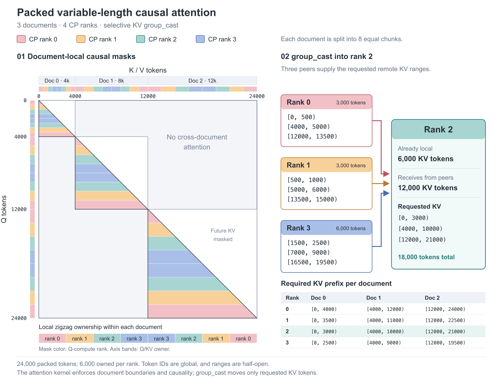

## Comunication Optimization

Replacing an AllGather-based CP communication scheme with `group_cast` and
`group_reduce` (grouped all-to-all-v) avoids communicating unneeded tokens.
The communication implementation can further optimize network utilization,
inter-node traffic volume, and SM usage.

### Balance outgoing traffic across NICs within a node

Balanced attention compute does not guarantee balanced communication. On a node
with eight ranks and one NIC per rank, outgoing data volumes can differ
substantially. If each rank sends only through its own NIC, lightly loaded NICs
become idle while ranks with larger payloads continue transmitting, leaving
the node's aggregate network bandwidth underused.

The proposed optimization first redistributes outgoing payloads through
intra-node device-to-device (D2D) transfers to balance the bytes sent by each
rank, then performs inter-node communication. This allows all eight NICs to
share the outgoing traffic and improves aggregate bandwidth utilization.

#### Workload scenario

The example below packs nine documents into 196,608 tokens across 32 CP ranks
(eight per node). Compute is nearly balanced, while per-rank transmit volumes
vary substantially.

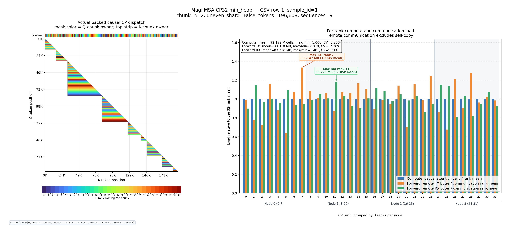

#### Implementation and NIC utilization

The comparison below uses the **Node 0 (CP ranks 0–7)** orange **Forward remote
TX** bars in the workload plot above (CSV row 1, `sample_id=1`). Values are read
from the image and rounded to 0.1 MB. The eight send volumes total approximately
632.0 MB, giving an ideal balanced target of **79.0 MB per NIC** based on the
Node 0 mean. About 64.1 MB would be redistributed locally while preserving the
total send volume and each token's destination.

The source metric excludes self-copy but does not separate intra-node from
inter-node traffic. These values model one sending NIC per rank; they are not
direct NIC counters. The balanced values are proposed targets, not measured
post-optimization results.

With equal NIC bandwidth `B` (MB/s) and no shared network bottleneck, the ideal
send phase decreases from approximately `111.1/B` to `79.0/B` seconds. Total
completion time also includes the added D2D and routing overhead.

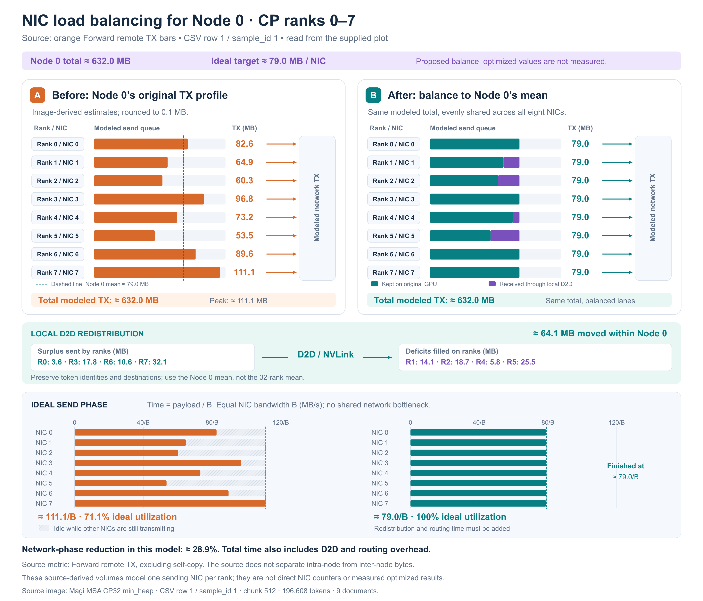

### Send one inter-node copy, then distribute over NVLink

When several ranks on the same destination node need the same KV segment,
send one inter-node copy to the destination rank with the same local GPU index
as the source rank. The receiving rank then makes that data available to the
local consumers over NVLink. This removes duplicate inter-node transfers of
the same data to different ranks on one node. `group_reduce` follows the reverse
pattern, combining contributions within a node before sending them back across
nodes.

For a single 192K-token document, a CP layout that assigns late Q chunks to
every rank makes each rank request nearly the full KV prefix. If all eight
ranks on a destination node need nearly the same KV data, hierarchical
communication can reduce each sender's inter-node volume to approximately
one eighth of flat per-rank delivery: one copy per destination node, followed
by intra-node NVLink distribution.

#### Workload scenario

The example below contains a single document of 196,608 tokens (192K) across
32 CP ranks (eight per node), illustrating the heavily overlapping KV prefixes
requested by different Q-owning ranks.

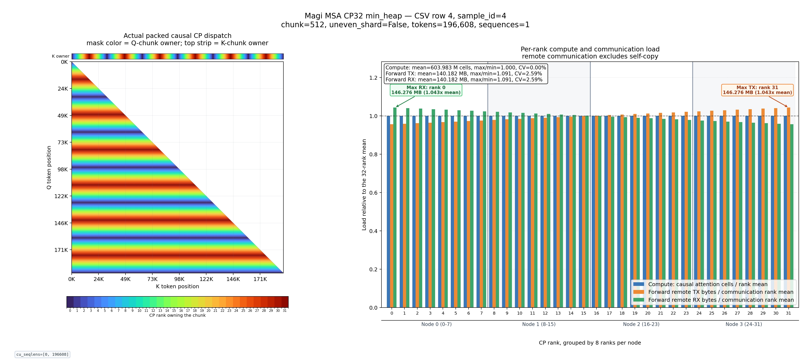

#### Implementation and communication volume

The schematic below follows one `S`-byte KV segment needed by all eight ranks
on a destination node. Flat delivery sends `8S` bytes across nodes; hierarchical
delivery sends `S` bytes across nodes and distributes `7S` bytes locally over
NVLink. For the same segment needed by all three remote nodes in CP32, the
inter-node payload falls from `24S` to `3S`. These are ideal payload volumes;
the actual saving depends on the overlap in KV requests.

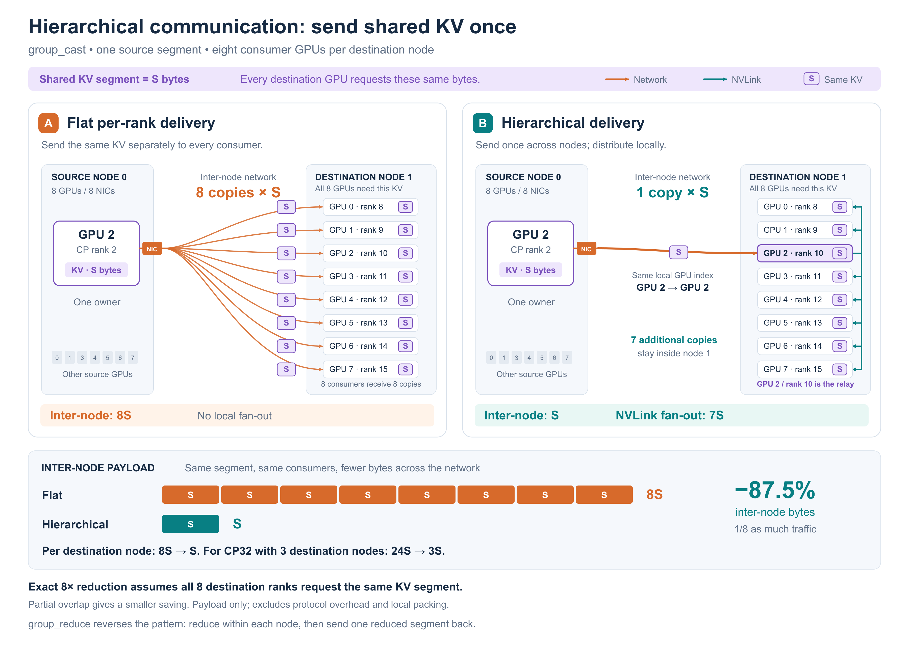

### SM usage optimization

Both CP communication and MoE dispatch/combine have all-to-all-v (a2av)
semantics, but their token access patterns differ. CP typically sends multiple
consecutive Q or KV tokens to each peer as contiguous ranges. MoE expert routing
often selects tokens interleaved throughout the input sequence, requiring
gather/scatter or packing. CP's contiguous ranges are well suited to bulk
transfers using GPU copy engines over NVLink.

For inter-node transfers, NCCL CP uses NCCL's host-side
[put/signal APIs](https://docs.nvidia.com/deeplearning/nccl/user-guide/docs/usage/p2p.html#one-sided-communication):
`ncclPutSignal` transfers data and signals its arrival, while `ncclSignal` and
`ncclWaitSignal` coordinate readiness and completion. Combining copy-engine
transfers with the network proxy path reduces communication's SM usage and
leaves more SM resources available for overlapped computation. Packing,
unpacking, and reduction kernels (may use multimem reduce in the future) can still use SMs.

## Dependencies

| Component | Requirement | Purpose |
|---|---|---|
| Python | 3.10+ | Public API |
| PyTorch | 2.12+ with the required distributed interfaces | Tensors, ProcessGroup and symmetric memory |
| Linux / NVIDIA driver | Compatible with CUDA/PyTorch | GPU execution |
| CUDA toolkit / C++ compiler | Matching PyTorch's CUDA major/minor; C++17 | Native compilation |
| NCCL | 2.30+ for zero-CTA | Host RMA and collectives |
| CMake | 3.24+ | Build and installation |
| Make / Git | Available on the build host | NCCL dependency preparation |
| pytest | Required for local tests | CPU/API validation |

Zero-CTA requires PyTorch's `NCCLSymmetricMemory` interfaces, an NCCL
ProcessGroup with ZERO CTA policy, and peer-accessible GPUs within each NVL
domain. A version number alone does not establish compatibility with these
PyTorch internal interfaces. Build and run with the same Python/PyTorch/CUDA/NCCL
environment. CPU tests use Gloo.

## Build

Run from `nccl_cp/` in an NCCL Extensions checkout with the execution
Python/PyTorch environment active:

```bash
export CUDA_HOME="<cuda-toolkit-prefix>"
make nccl-submodule
export NCCL_HOME="$PWD/../third_party/nccl/build"
export PATH="$CUDA_HOME/bin:$PATH"
export LD_LIBRARY_PATH="$NCCL_HOME/lib:$CUDA_HOME/lib64${LD_LIBRARY_PATH:+:$LD_LIBRARY_PATH}"

cmake -S . -B build -G "Unix Makefiles"
cmake --build build --parallel
```

`make nccl-submodule` delegates to the enclosing repository and builds its
shared pinned NCCL dependency. For an existing NCCL build, skip this
step and set `NCCL_HOME` to its prefix. Source archives require this external
dependency path. Use `lib64` in the library path when applicable.

CMake discovers Python/CUDA from the environment and checks NCCL headers against
`torch.cuda.nccl.version()`. Compiler-supported targets are selected by the build configuration;
`CUDAARCHS` or `CMAKE_CUDA_ARCHITECTURES` overrides selection.

| Artifact | Location |
|---|---|
| Native library and manifest | `build/lib/libnccl_cp.so`, `build/lib/libnccl_cp.build.json` |
| Staged Python package | `build/python/nccl/cp/` |
| Build-tree launcher | `build/bin/nccl_cp_run.py` |

For CPU tests or a flat-only package, configure `-DNCCL_CP_BUILD_NATIVE=OFF`.
To install the CMake artifacts:

```bash
cmake --install build --prefix /path/to/nccl-cp-install
python /path/to/nccl-cp-install/bin/nccl_cp_run.py /path/to/application.py
```

The launcher loads the package alongside other installed `nccl` extensions.
Keep the native library, its manifest and runtime dependencies together.

## Quick Start

[examples/basic.py](examples/basic.py) initializes the ProcessGroup, allocates
buffers, reuses a handle and checks cast/reduce results:

```bash
torchrun <launcher-options> \
  build/bin/nccl_cp_run.py examples/basic.py \
  --nvl-domain-size <ranks-per-domain>
```

Supply launcher options for process allocation and rendezvous. Set the domain
size from the communicator topology; the example does not select devices or
infer NVL domains from the number of processes on a host.

For an application with an initialized `nccl_group`, local layouts and allocated
input/output tensors:

```python
import torch
from nccl.cp import (
    CpConfig, create_group, create_handle, group_cast, group_reduce, close_runtime,
)

num_heads, head_dim = input.shape[1:]  # input: [num_tokens, num_heads, head_dim]
stream = torch.cuda.current_stream()
config = CpConfig(
    max_per_peer_slot=4096,
    payload_shape=(num_heads, head_dim),  # Per-token shape, excluding the token axis.
    dtype=torch.bfloat16,
    nvl_domain_size=ranks_per_domain,  # Supplied by the application.
)
group = create_group(nccl_group, config)
handle = create_handle(group, local_input_layout, local_output_layout, stream=stream)

with torch.no_grad(), torch.cuda.stream(stream):
    group_cast(handle, input, output, stream=stream)
    grad_output.zero_()  # Omit when accumulating into existing values.
    group_reduce(handle, grad_input, grad_output, stream=stream)

stream.synchronize()  # Teardown boundary, outside the communication loop.
handle.close()
close_runtime(group)  # Before destroying the ProcessGroup.
```

The method forms `handle.group_cast(...)` and `handle.group_reduce(...)` have
the same tensor/stream arguments. Immediate APIs write the supplied output and
return `None`; they do not wait for GPU completion.

## Configuration and Layouts

`create_group(nccl_group, config)` binds a caller-owned ProcessGroup and immutable
configuration without communication. `None` selects WORLD. All ranks supply the
same configuration and keep their assigned CUDA device fixed. `CpGroup.nccl_group`
and `CpGroup.cp_config` expose those objects.

| `CpConfig` field | Configuration | Meaning |
|---|---|---|
| `max_per_peer_slot` | Required | Native peer-slot capacity C, in token rows |
| `payload_shape` | Required | Per-token dimensions; `()` describes a scalar |
| `dtype` | Required | Storage dtype used to size capacity |
| `max_per_token_bytes` | Derived | B = `prod(payload_shape) * dtype.itemsize` |
| `max_layout_tokens` | C | Owned-token bound per rank for handle metadata; independent of workspace capacity |
| `runtime_slot` | `0` | Workspace slot within the ProcessGroup |
| `nvl_domain_size` | Set explicitly for the communicator | Ranks per NVL domain |
| `backend` | `"auto"` | Prepare zero-CTA when eligible; `"all2allv"` selects flat |

For `num_heads=32`, `head_dim=128` and BF16, B is 8192 bytes. Size C/B for the largest intended
traffic. Configuration does not convert tensors. A slot can reuse a larger byte
capacity, but token/domain capacities must match; use another slot for different
bounds.

### Handle input and output layouts

Both layouts are host-side `Sequence[int | TokenRange]` descriptions. Each integer
identifies one token occurrence; `TokenRange(start, stop)` describes the half-open
interval `[start, stop)` in ascending order. IDs are shared across the group and
identify token occurrences, not vocabulary entries. They carry no tensor data.

| Argument | What this rank declares | Tensor row mapping |
|---|---|---|
| `local_input_layout` | Tokens owned by this rank, in local input order | Cast input and reduce output |
| `local_output_layout` | Tokens this rank requests, in the desired result order | Valid cast output prefix and valid reduce input prefix |

`local_input_layout` describes **every row of the supplied cast input**, in
axis-0 order. Its expanded token count must equal both the cast input row count
and the reduce output row count. Each declared token ID belongs to exactly one
rank in the group; IDs can be nonconsecutive and need not be numerically sorted.
Include each input row even when no rank requests it. Rows unrequested by every
rank do not appear in cast outputs, and their reduce output values stay unchanged.

`local_output_layout` describes the **complete requested output**, including
remote tokens and any locally owned tokens that should appear in the result.
The caller does not need to know the remote owners: handle preparation resolves
them from the input layouts exchanged across the group.

For example, suppose this rank owns `[100, 101, 102]` and another owner declares
`[200, 201]` in that order:

```python
from nccl.cp import TokenRange

local_input_layout = [TokenRange(100, 103)]
local_output_layout = [100, 200, 101, 201]
```

Cast writes rows for tokens `100, 200, 101, 201` in exactly that order. Reduce
reads contributions in the same order and sends each back to its owner;
this rank's accumulator rows still correspond to `100, 101, 102`. If no rank
requests token `102`, its accumulator row is left unchanged.

- Every requested ID must have exactly one owner. Neither local layout may
  repeat an ID, including through overlapping ranges.
- Requests from the same owner must preserve that owner's declared input order;
  different owners may interleave. This is not a numeric sorting requirement.
  In the example, requesting `101` before `100` is invalid.
- The logical row count is the sum of interval lengths and individual IDs,
  not the number of layout entries. The example has three input rows and four
  output rows. Additional output buffer capacity is not listed in the layout.
- `local_input_layout=[]` declares no owned rows: cast input and reduce output
  have zero rows. The output layout may still request tokens owned by other ranks.
- `local_output_layout=[]` requests no rows. The rank still participates in
  matching calls and may have relay work.

The caller keeps actual tensor rows consistent with these descriptions.

`create_handle(group, local_input_layout, local_output_layout, *, stream)` exchanges
layouts and prepares this rank's route and relay work. Changed ownership, requests
or row order require a new handle. Preparation/uploads run outside CUDA Graph capture.

There is one fixed-size tensor AllGather containing both lengths and contents.
With W ranks and C = `max_layout_tokens`, each frame occupies
`8216 + 16*C*(1+W)` bytes, and every rank receives W frames. Owned rows are bounded
by C and requested rows by W*C. Endpoints fit signed int64. Even compact layouts
exchange the padded frame, so choose C deliberately and identically across ranks.
Each rank computes its own four lists and the relay metadata it needs.

## Tensor and Reduction Contract

Input/output are required caller-owned tensors with matching dtype, device and
per-token shape. CP never allocates or replaces the output buffer.

| Operation | Input rows | Output rows |
|---|---|---|
| Cast | Exactly the local input layout | At least the local output layout |
| Reduce | At least the local output layout | Exactly the local input layout |

Cast writes the valid output prefix and leaves trailing capacity unchanged.
Reduce ignores the input tail and **adds** contributions to existing output.
Zero output first for a plain sum. Unrequested owner rows retain their values.
Native callers guarantee adequate row capacity; flat/explicit paths validate it locally.

These keyword options apply to functions, handle methods and their async variants:

| API | Option | Supported value |
|---|---|---|
| Cast | `cast_lse` | `False` |
| Reduce | `reduce_op` | `"sum"` |
| Reduce | `acc_reduce` | `True` |
| Reduce | `comm_dtype` | `None` or the input dtype |
| Both | `input_lse`, `output_lse` | `None` |

Other values raise `NotImplementedError` before submission; explicit-list calls
reject them before preparation. LSE, dtype conversion, average reduction and
overwrite mode are not implemented. Parameter definitions are also documented
in [src/collectives.py](src/collectives.py).

## Explicit Global Lists

Callers with complete routing information can use the following signatures:

```python
def group_cast_explicit(
    input, output, input_split_size_list, output_split_size_list,
    dst_indices_list, src_index_list, *, group, stream,
    cast_lse=False, input_lse=None, output_lse=None,
) -> None: ...

def group_reduce_explicit(
    input, output, input_split_size_list, output_split_size_list,
    dst_index_list, src_indices_list, *, group, stream,
    reduce_op="sum", acc_reduce=True, comm_dtype=None,
    input_lse=None, output_lse=None,
) -> None: ...
```

Tensors are local. Each routing argument is a Python list with W outer entries,
indexed by group-relative rank r:

| Argument | Cast | Reduce |
|---|---|---|
| `input_split_size_list[r]` | Input segment lengths | Contribution segment lengths |
| `output_split_size_list[r]` | Output segment lengths | Accumulator segment lengths |
| Destinations | `dst_indices_list[r][i]`: distinct recipients rank of segment i | `dst_index_list[r][i]`: owner rank of contribution i |
| Sources | `src_index_list[r][j]`: owner rank of segment j | `src_indices_list[r][j]`: distinct contributors rank to segment j |

Starts are prefix sums; lengths are nonnegative integers; ranks lie in `[0, W)`.
Tensor metadata and sentinel rank padding are unsupported. Peer token counts
must pair and preserve within-source order. Tensor capacity rules apply to the
local split sums. Empty destination/source lists are allowed.

To reverse cast, swap its input/output split lists, use its source list as reduce
destinations and its destination lists as reduce sources. These APIs accept no
handle: each call prepares this rank's plan and uploads metadata without a route
AllGather. All ranks supply identical global routes, configuration and backend
policy. For repeated calls, prepare a handle from layouts instead.

## Streams, Async Completion and Lifetimes

`stream` accepts a CUDA stream object or raw pointer (`0` means the default
stream); CPU/Gloo uses `None`. Preparation, explicit-list and flat calls select
it internally. **Prepared zero-CTA calls require this stream to be current already**;
select it outside the submission loop. Raw stream pointers remain caller-owned.

`group_cast_async`, `group_reduce_async` and their handle methods return
`WorkWithPostProcessFn`. The `*_explicit_async` functions take the same arguments
as their immediate explicit counterparts.

```python
from nccl.cp import group_cast_async, group_reduce_async

with torch.no_grad(), torch.cuda.stream(stream):
    work = group_cast_async(handle, input, output, stream=stream)
    independent_compute()  # Must not consume output or modify CP buffers.
    work.wait_post_process()  # Submits completion dependencies and output gather.
    consume(output)

    work = group_reduce_async(handle, grad_input, grad_output, stream=stream)
    independent_backward_compute()
    work.wait_post_process()  # Submits accumulation into grad_output.
```

Call `wait_post_process()` exactly once on the same current stream as launch,
before consuming output or reusing the native slot. It returns the supplied
output after submitting post-processing; CUDA completion is not implied.
A native slot permits only one work awaiting post-processing. Discarding work
does not complete it. These are not Python coroutines.

Caller responsibilities:

- Match operation order, routes and per-token formats across ranks, including
  empty/relay-only ranks. CP does not negotiate them in data calls.
- Keep one fixed stream per native slot and serialize submissions with preparation
  and teardown. Order producers before communication and consumers after completion;
  explicitly establish dependencies for other streams.
- Retain work until `wait_post_process`, and tensors, handles and external streams
  until GPU completion. Do not resize/rebind buffers while they are in use.
- Supply any required `no_grad` scope and autograd integration. CP does not
  register automatic backward operations.
- Stop submissions through all CP groups sharing a ProcessGroup before teardown.
  Finish post-processing and GPU uses, close handles, then call `close_runtime`
  before destroying that ProcessGroup.

`handle.close()` releases native plans without synchronization or freeing shared
workspace. The native registry owns workspace per ProcessGroup/slot.
`close_runtime(group)` drains/releases every slot of that ProcessGroup, including
slots shared by sibling CP groups, and may block the host. Deleting a group/handle
does not perform this cleanup. Local errors are not broadcast; recovery must be
coordinated by the application.

## Backends

| Backend | Payload dtype | Layout / topology |
|---|---|---|
| zero-CTA | FP32, BF16 | Dense trailing dimensions; token-axis stride padding allowed; contiguous peer-accessible rank blocks per NVL domain |
| Flat all2allv | FP16, BF16, FP32, FP64 | Strided tensors with nonoverlapping output; NCCL GPU or Gloo CPU |

Handle preparation checks native availability, configuration, topology and capacity
across ranks. `handle.backend` reports the choice; `handle.fallback_reason` explains
fallback. `backend="all2allv"` or `NCCL_CP_DISABLE_ZERO_CTA=1` selects flat.
A prepared handle never switches backend or grows workspace during a data call;
payload bytes must fit its runtime. Rounding can differ with reduction grouping.

Explicit-list preparation uses shared routes/configuration to determine eligibility.
If a required local native prerequisite is unavailable, it raises; callers select
flat consistently across ranks. Running communication failures propagate and are
never retried through another backend.

Group creation and runtime teardown perform no CP control AllGather. Handle creation
performs one; prepared data calls perform none and upload no metadata. Native slot
initialization separately connects/rendezvous/registers symmetric buffers. This
setup can communicate and is reused by compatible handles.

## Examples

### Two-rank causal attention: forward and backward

Each rank owns 4,096 Q/K/V tokens from one 8,192-token document:

| CP rank | Local Q/K/V tokens | KV tokens needed for local attention |
|---|---|---|
| 0 | `[0, 4096)` | `[0, 4096)` |
| 1 | `[4096, 8192)` | `[0, 8192)` |

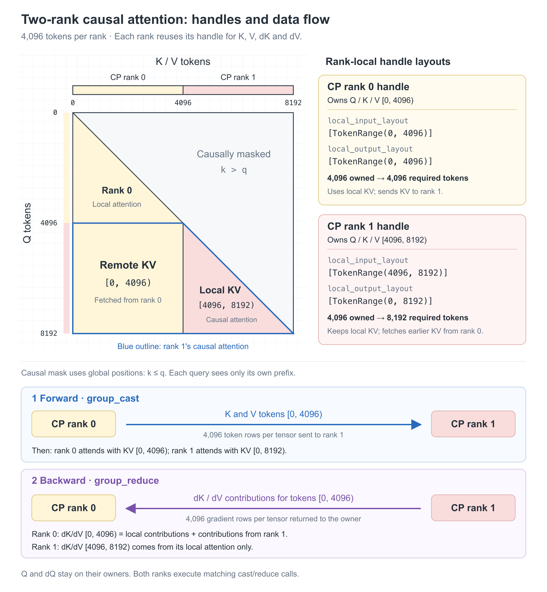

Assume `nccl_group` contains these two ranks, each rank has selected its CUDA
device, and `q_local`, `k_local` and `v_local` hold its local tokens. K and V
have shape `[4096, num_heads, head_dim]` with matching dtype and device.
`ranks_per_domain` describes the application's NVLink topology.

The following **pseudocode** shows the forward/backward data flow. See
[Quick Start](#quick-start) for explicit stream and resource-lifetime handling.
The attention calls represent the caller's kernels. `q_start` gives the
global position of the first local query; the
gathered KV starts at position 0, so the causal mask uses `k <= q` in global
token positions. `dout_local` is the output gradient supplied by later layers.

```python
import torch
import torch.distributed as dist
from nccl.cp import (
    CpConfig, TokenRange, create_group, create_handle,
    group_cast, group_reduce,
)

local_token_count = 4096
rank = dist.get_rank(nccl_group)  # CP rank 0 or 1.
q_start = rank * local_token_count
q_stop = q_start + local_token_count
num_heads, head_dim = k_local.shape[1:]
config = CpConfig(
    max_per_peer_slot=local_token_count,
    payload_shape=(num_heads, head_dim),  # Per-token shape, excluding the token axis.
    dtype=k_local.dtype,
    nvl_domain_size=ranks_per_domain,
)
group = create_group(nccl_group, config)
handle = create_handle(
    group,
    local_input_layout=[TokenRange(q_start, q_stop)],  # Owned K/V tokens.
    local_output_layout=[TokenRange(0, q_stop)],      # Required K/V prefix.
)

# Rank 0 needs 4,096 KV tokens; rank 1 needs 8,192.
k_needed = torch.empty(
    (q_stop, num_heads, head_dim), dtype=k_local.dtype, device=k_local.device,
)
v_needed = torch.empty_like(k_needed)
dk_local = torch.zeros_like(k_local)
dv_local = torch.zeros_like(v_local)

with torch.no_grad():
    # Forward: rank 0 sends K/V [0, 4096) to rank 1; local K/V is also copied.
    group_cast(handle, k_local, k_needed)
    group_cast(handle, v_local, v_needed)
    attn_out, ctx = attention_forward(
        q_local, k_needed, v_needed, causal=True, q_start=q_start,
    )

    # Backward: compute contributions for every KV token used by local Q.
    dq_local, dk_partial, dv_partial = attention_backward(dout_local, ctx)

    # Reverse the same route and sum contributions into zeroed owner buffers.
    group_reduce(handle, dk_partial, dk_local)
    group_reduce(handle, dv_partial, dv_local)
```

Both ranks execute the calls in the same order, reusing one handle for K, V,
dK and dV. After the forward casts, rank 1 has KV `[0, 8192)` and rank 0 has KV
`[0, 4096)`. The attention kernel still masks future tokens within each prefix.

During backward, rank 1 sends its dK/dV contributions for `[0, 4096)` back to
rank 0. `group_reduce` sums them with rank 0's local contributions. Gradients
for `[4096, 8192)` stay on rank 1, and dQ stays on each Q-owning rank.
The reduce buffers start at zero because `group_reduce` accumulates into them;
clear them again before another iteration unless accumulation is intended.

The same flow extends to packed variable-length samples and larger CP groups.
Each rank can describe multiple disjoint owned and required token ranges with
`list[TokenRange]`, as in the [packed variable-length example](#packed-variable-length-samples).
Different CP load-balancing algorithms can assign tokens differently; the
application translates each assignment and its attention dependencies into
`local_input_layout` and `local_output_layout`. `create_handle` derives the
communication plan from these layouts, while the `group_cast` / attention /
`group_reduce` flow stays the same. Recreate the handle when the token layouts
change. The attention kernels remain responsible for document boundaries and
causal masks.

## Tests

Run the complete local suite through the built package:

```bash
python build/bin/nccl_cp_run.py --module pytest tests -q
```

Alternatively configure `-DNCCL_CP_BUILD_TESTS=ON` and run
`ctest --test-dir build --output-on-failure`. Distributed runners are separate:

| Runner | Coverage |
|---|---|
| [tests/run_distributed.py](tests/run_distributed.py) | Native direct/hierarchical plans, FP32/BF16 numerical results |
| [tests/run_public.py](tests/run_public.py) | Public routes, reuse, lifecycle, fallback, errors |
| [tests/run_padding.py](tests/run_padding.py) | Capacity tails and reverse reduction |
| [tests/run_async.py](tests/run_async.py) | Deferred output, accumulation, stream/slot ordering, reserved options |

The public runners require explicit `--backend` and `--nvl-domain-size` values.
The native-only runner requires `--nvl-domain-size` and uses NCCL. Launcher
options control rank allocation and rendezvous; there are no fixed device IDs,
process counts, addresses or ports in these examples:

```bash
torchrun <launcher-options> \
  build/bin/nccl_cp_run.py tests/run_public.py \
  --backend <gloo-or-nccl> --nvl-domain-size <ranks-per-domain>

torchrun <launcher-options> \
  build/bin/nccl_cp_run.py tests/run_distributed.py \
  --nvl-domain-size <ranks-per-domain>
```

Use the same explicit arguments for `run_padding.py` and `run_async.py`.
`--require-zero` requires native selection; the public runner's `--force-flat`
selects the fallback. The public runner needs multiple ranks for its cross-rank
error cases. Direct/hierarchical selection follows communicator size and domain
size. Relay-only cases are generated when multiple multi-rank domains exist.

Unit tests use synthetic routes, temporary directories and mocked compiler/device
properties. Those fixtures validate contracts without requiring matching hardware.
Distributed results report test outcomes; they do not collect host names, GPU
identifiers or software inventory.
